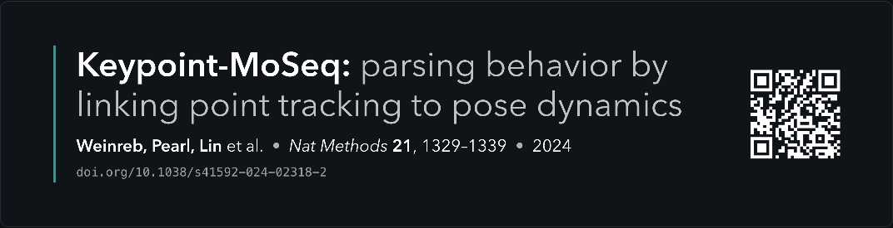
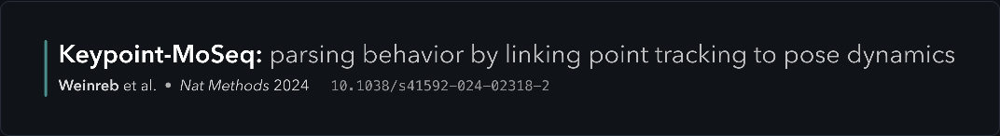

# DOI / Link Banner

Paste a DOI or web link — or a whole list of them — and get a transparent resource banner for your slides.

**→ https://robertodf.github.io/doi-banner/**





*Both generated from `10.1038/s41592-024-02318-2`, shown here on a dark plate —
the exported PNGs have a fully transparent background.*

Built for talks: use the same visual treatment for papers and web resources. DOI inputs resolve publication metadata automatically; ordinary links become editable resource cards with a QR code pointing to the target URL.

## What it does

- DOI inputs look up metadata from **Crossref**, falling back to **DataCite** and `doi.org` content negotiation.
- Generic `http(s)` links are accepted directly, rendered locally, and remain fully editable. This avoids depending on a CORS/proxy service for arbitrary webpages.
- Renders two shapes:
  - **Card** — 1800 px wide, for a title slide or a section divider.
  - **Footer strip** — a thin one-line credit (authors, journal, year, DOI)
    for the bottom of a slide you have already titled.

  Both are sized to their content, so there is no dead space around the text.
- Takes **several resources at once**, including mixed DOI + URL lists. Paste one per line and they come back
  stacked into a single image — handy for a references slide or a
  “building on” slide. Up to 12 per run; a DOI that fails to resolve is
  reported and the rest are still drawn.
- Exports **PNG** (at 2×, so it stays crisp on a projector) or **SVG**. The
  preview backdrop is what you get: transparent, dark or light.
  Picking a dark or light backdrop flips the text colour to match.
- Everything runs in the browser. Nothing is uploaded, no build step, no
  dependencies to install.

## Options

| Control | Notes |
| --- | --- |
| Text | White for dark slides, near-black for light ones. |
| Typeface | Humanist sans, serif, grotesk or mono — all system fonts. |
| Accent | The rule beside the text. Presets plus a colour picker. |
| QR to target | Optional. For DOI resources it points to `doi.org`; for links it points directly to the supplied URL. Add a white plate if your audience scans with Android — inverted QR codes are not universally readable. |
| Edit text | Every field is editable if the publisher's metadata is wrong or too long. With several DOIs loaded, these fields edit the first paper. |

## Deep links

Append a DOI or URL to the hash and the banner is built on load:

```
https://robertodf.github.io/doi-banner/#10.1038/s41592-024-02318-2
```

For multiple or mixed resources, the app stores the encoded list in the hash.

```
https://robertodf.github.io/doi-banner/#https%3A%2F%2Felixir-europe.github.io%2Fds-handbook%2F
```

## Notes

- SVG export references fonts **by name**, so it will only look identical on a
  machine that has them. For sharing, PNG is the safe format.
- QR generation uses [qrcode-generator](https://github.com/kazuhikoarase/qrcode-generator)
  by Kazuhiko Arase (MIT), vendored in `vendor/`.

## Running locally

```bash
git clone https://github.com/dhuzard/doi-link-banner.git
cd doi-link-banner
python3 -m http.server 8000
```

Then open <http://localhost:8000>.

## Licence

MIT.
